# Body and Soul Yoga

This is a website created for users of  all levels of fitness and abilities, to research different types of yoga offered, tutorials on each and a form to sign up for more information. Users will be able to try out the different types of yoga and determine which they would prefer. The target audience here is very broad as yoga is such a popular workout and can be done by anyone regardless of age or fitness ability.

### User story
* As a user, I want to find out more information about yoga. I am a novice on this subject and am interesed in researching it more before I commit to a yoga class. I would like to see the different types of yoga and also tutorials that I can follow at home so I can decide then which class to take if I decide to proceed.

## Design

I based the design of this website off the five design planes in UXD.

* Strategy 

    I want to design a website for users who would like more information on yoga, specifically the different types of yoga, which will include tutorials for users to try out at home before committing to trying a class in a studio. The target audience here is broad as yoga can be practiced by anyone regardless of fitness ability.

* Scope

    I plan on having a landing page explaining what the website is for and I plan on including a page for both types of yoga and a page for tutorials of those types which will ensure the flow of the website is good.

* Structure

    There will be an image on all pages which will be similar but not the same. The about us and benefits sections on index.html will be grouped into divs which is contained in a section.

    The navigation menu will be an unordered list with an anchor element in each to direct the users to the various pages.
    
    The types of yoga will be contained in divs with a display on inline block so they are horizontally displayed across the page.

    The tutorials page will be seperated by sections containing divs. The divs will be given a class so they can be styled in the stylesheet as one.

    The signup page will have a simple yet functional form to allow the user to enter their details to sign up for more information. This will be a section that contains a form element and a submit button.

* Skeleton

    The navigation links will appear the same on each page which will make the site easily readable and easy to learn for a first time user. I designed this in Balsamiq which was a great tool to use so I could then implement the features on each page.

* Surface

## Features

- ### Navigation Bar
     * This is featured across all four pages and provides clickable links to the Homepage, Types of Yoga, Tutorials and Sign up page which prevents the user from clicking the browsers back button.
     * This is a fully responsive navigation bar and is consistently styled across all pages.

     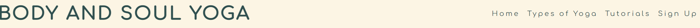

- ### Landing page image
    * The landing page image is that of a woman practicing Yoga at sunset which goes with the theme of the website. It's soft tones is calming yet eyecatching.
    * There is also a quote, credit is stated under the quote, which adds to the ambiance of the page and website.
    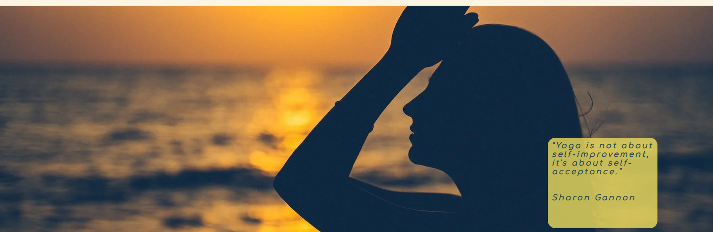
    * There is similar images and quotes across the four pages, each containing a variety of someone practicing a yoga pose with the sunset in the background and a thoughful and relevant quote on each image.

- ### About us and benefits of yoga sections
    * Here the user can read a bit about those behind the page and find out what the page is all about. It's short yet decriptive.
    * The benefits are listed here in an unordered list which can motivate and encourage the user to try a yoga tutorial or class.
    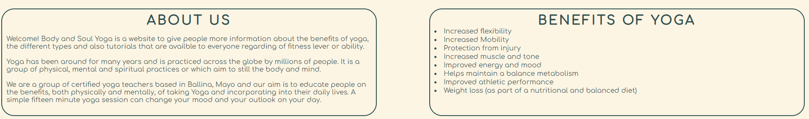

- ### Social media links
    * These are contained in the footer and are consisent throughout the entire site. 
    * There are five links to social media sites; Facebook, Twitter, Instagram, Youtube and TikTok.
    * Each of the links when clicked will open up the link in a new tab to prevent the user from 
    having to use the browsers navigation to return to the website.
    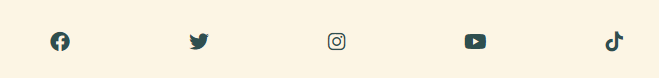

- ### Types of Yoga
    * This displays the different types of Yoga and a short description of each with a view to inform the user of the difference between them.
    * They are diaplyed across the page which is readable to the user and the font and border colours are the same and flows naturally throughout.
    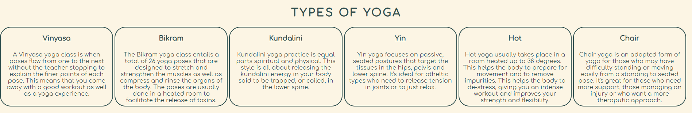

- ### Tutorials
    * Here the user has the choice of 6 tutorials. There is one for each of the types in the previous page to keep in with the flow of the website. 
    * The tutorials are all Youtube links and give the user full control of playback and whether they maximise the screen or watch on the default size provided.
    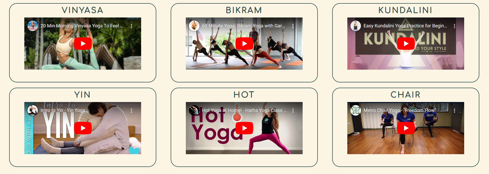

- ### Sign up form
    * The user is presented a form here that they can enter in their name and email address in order to sign up and receive further communications.
    * The form is style using the same colours and fonts to give the site a natural flow and not be too visually demanding. 
    * The sign up button has a hover effect so when the user hovers over this, the background and foreground colors switch to give the use a sense of feedback.
    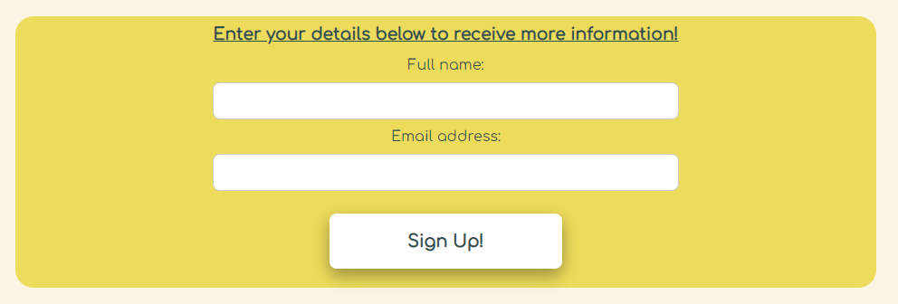

- ### Features left to implement
    * A list of classes with details such as times and location and allow the user to be able to book a space online and send a confirmation email back to the client.
    * I think a gallery page here would fit in quite nicely and display the various types of yoga mentioned earlier.

- ### Technologies used
    * HTML
    * CSS
    * Github
    * Gitpod
    * Balsamiq

- ### Testing here
    * I have checked the link on various browers adn it appears to be working. I have also checked it on different devices including a tablet and my own phone (Samsung S22) and the media queries appear to be working to make the site responsive.
    * The site is quite readable and easy to learn for a user visiting the site for the first time. The contrast between the background and foreground is high and the images flow well with each other throughout the site.
    * The form links to the "formdump" at Code Institute so I can ensure that the form works even though it does not have any further functionality.
    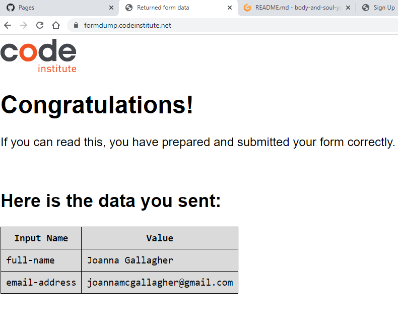

- ### Bugs
    * When the code was run through the HTML validator, a number of warnings showed up regarding the sections on html.index. I had to change these to divs instead and that was accepted then by the validator.
    * I had issues with the media queries when run. When I checked the amiresponsive website, it showed that the phone size navigation menu appeared on two lines. However, I worked on this for quite a while and amended the media queries. I tested on my own phone and it appeared to work well.

- ### Unfixed bugs
    * The bug mentioned above regarding the amiresponsive phone size remains unfixed. I have researched this and done multiple tests but cannot resolve.

### Validator testing
- HTML.

    I ran the site through the HTML validator https://validator.w3.org/#validate_by_uri and after a couple of warnings that I resolved, the code passed with no warnings or errors.
    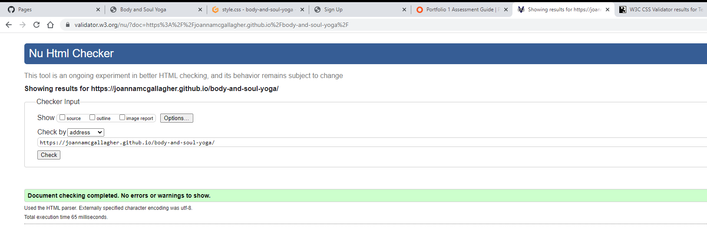
- CSS

    The code was run through the CSS validator where it passed with no warnings or errors. https://jigsaw.w3.org/css-validator/validator
    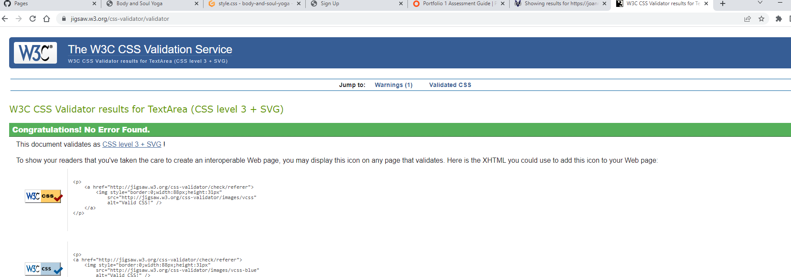
- Lighthouse

    I used the Lighthouse tool in Chrome development tools to check the accessibility of the site and it received 100.
    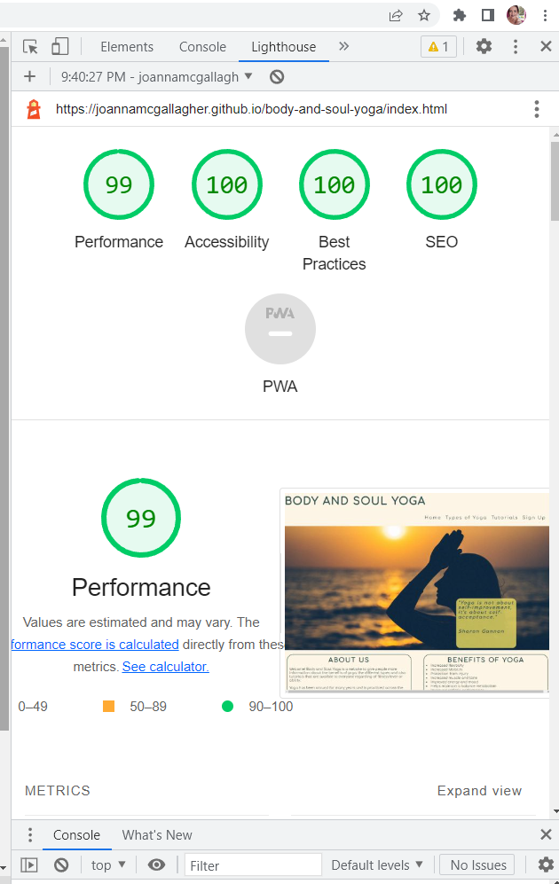

### Deployment
- Repo here
- Main Branch
- Live link here

### Content
* Images : Images sourced from www.pexels.com
* Videos : Videos sourced from www.youtube.com (I created a playlist to contain these and it can be found [here](https://www.youtube.com/playlist?list=PLW8iztGI7CsfJsOy7r7hZtatF3Q9GwvZh)).
* Icons : Icons were part of the Font Awesome script.
* Fonts : Google fonts were used here to find the correct font that would benefit the page and be easily readable.

### Credits
* Walkthrough project - Love Running which can be found here.
    * I was able to use this for reference multiple times on this site; 
        * Navigation Links
        * Footer
        * The running times section was able to provide some clarity around the styling of the divs in the types of yoga page.
        * Shadow Button :
        * Sign up form :

    